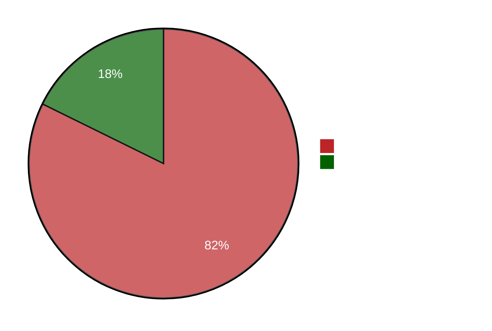

# Going Minimal
## A guide to improving container image security

---
layout: full
---

<div class="grid grid-cols-[1fr_35%] gap-6">

<div>
<h1 class="bold">Who am I?</h1>

<br/>

<h2>Software engineer turned Cloud Enthusiast <noto-cloud /></h2>
<br/>
<h2>Kubernetes wizard <noto-magic-wand /></h2>
<br/>
<h2>Linux Nerd <devicon-linux /></h2>
</div>

<div>

</div>

</div>

<!--
Originally I started my career as a Java Software Developer, but everything changed when I stumbled
upon Linux and the cloud. This definitely transformed me into a full-on Linux nerd. Do not question the MacBook though.
-->

---


<!--
With this out of the way, let me ask you some quick questions.

Who of you here has heard of Distroless before?

Who of has heard about Chainguard images?
-->

---

<h1><span class="red-danger">Vulnerable</span> AWK Playground</h1>

<!--
* going to containerize application
* simple golang application
* offers an rest endpoint to test awk scripts
* shells out to AWK

AWK
* versatile programming language and command-line utility for text processing.
* is known for its pattern scanning and processing capabilities.
* However, there's a crucial issue: the original developer overlooked the fact
that AWK features various way of executing binaries.

-->

---
layout: full
---

```shellsession
> vulnerable-awk-playground
   ____    __
  / __/___/ /  ___
 / _// __/ _ \/ _ \
/___/\__/_//_/\___/ v4.11.2
High performance, minimalist Go web framework
https://echo.labstack.com
____________________________________O/_______
                                    O\
```

<hr/>

```shellsession
> curl -X POST \
>   -F 'text=hello world' \
>   -F 'awkScript={print $1}' localhost:8080/test

{"stderr":"","stdout":"hello\n"}
```

<!--
* here we see it in action
-->

---
layout: image
image: /pexels-karolina-grabowska-4464482.jpg
---


<!--
* lets containerize it
-->

---
layout: full
---

<div class="stack">

<span>

*dockerfiles/Dockerfile.all-in-one*
```docker
# Our dockerfile
```
</span>
<v-clicks>

<span>

*dockerfiles/Dockerfile.all-in-one*
```docker
# Our dockerfile
FROM golang:1.21.3-bookworm
```

</span>

<span>

*dockerfiles/Dockerfile.all-in-one*
```docker
# Our dockerfile
FROM golang:1.21.3-bookworm

WORKDIR /app
COPY go.mod go.sum main.go /app/
RUN go build -o vulnerable-awk-playground ./main.go
RUN cp vulnerable-awk-playground /usr/bin/
ENTRYPOINT ["vulnerable-awk-playground"]
```

</span>

</v-clicks>
</div>

---
layout: full
---

<div class="stack">

<span>

```shellsession
> docker build . \
>       -t vulnerable-awk-playground:all-in-one \
>       -f dockerfiles/Dockerfile.all-in-one
```

</span>

<v-clicks>

<span>

```shellsession
> docker build . \
>       -t vulnerable-awk-playground:all-in-one \
>       -f dockerfiles/Dockerfile.all-in-one
...
=> exporting layers                                                 1.0s
=> writing image ....                                               0.0s
=> naming to docker.io/library/vulnerable-awk-playground:all-in-one 0.0s
```
</span>

<span>

```shellsession
> docker build . \
>       -t vulnerable-awk-playground:all-in-one \
>       -f dockerfiles/Dockerfile.all-in-one
...
=> exporting layers                                                 1.0s
=> writing image ....                                               0.0s
=> naming to docker.io/library/vulnerable-awk-playground:all-in-one 0.0s

> docker image ls vulnerable-awk-playground:all-in-one \
>           --format '{{.Repository}}:{{.Tag}} {{.Size}}'
```
</span>
</v-clicks>

</div>

---
layout: image
image: /pexels-vitalina-12572535.jpg
---
---
layout: full
---
```shellsession
> docker build . \
>       -t vulnerable-awk-playground:all-in-one \
>       -f dockerfiles/Dockerfile.all-in-one
...
=> exporting layers                                                 1.0s
=> writing image ....                                               0.0s
=> naming to docker.io/library/vulnerable-awk-playground:all-in-one 0.0s

> docker image ls vulnerable-awk-playground:all-in-one \
>           --format '{{.Repository}}:{{.Tag}} {{.Size}}'

vulnerable-awk-playground:all-in-one 1.01GB
```

---

<span class="big-fat bold">1.01GB</span>

---
layout: image
image: /pexels-victor-freitas-949128.jpg
---

---
layout: full
---

<div class="full-center">



</div>

---
layout: image
image: /pexels-lukas-952354.jpg
---

<div class="h-full" style="display: flex; justify-content: end; flex-direction: column">
    <span class="fancy-headline">Multi-Stage Builds</span>
</div>

<!--
* we can stepup our game with a nifty feature called multistage builds
* instead of cramming everything into a single image, we will a image for building and another for runtime
* this should decrease the image size by quite a bit
-->

---
layout: full
---

<div class="stack">

<span>

*dockerfiles/Dockerfile.multi-stage-ubuntu*
```docker
# Our dockerfile
FROM golang:1.21.3-bookworm

WORKDIR /app
COPY go.mod go.sum main.go /app/
RUN go build -o vulnerable-awk-playground ./main.go
RUN cp vulnerable-awk-playground /usr/bin/

ENTRYPOINT ["vulnerable-awk-playground"]
```

</span>

<v-clicks>

<span>

*dockerfiles/Dockerfile.multi-stage-ubuntu*
```docker {2}
# Our dockerfile
FROM golang:1.21.3-bookworm as build

WORKDIR /app
COPY go.mod go.sum main.go /app/
RUN go build -o vulnerable-awk-playground ./main.go
RUN cp vulnerable-awk-playground /usr/bin/

ENTRYPOINT ["vulnerable-awk-playground"]
```

</span>

<span>

*dockerfiles/Dockerfile.multi-stage-ubuntu*
```docker {8}
# Our dockerfile
FROM golang:1.21.3-bookworm as build

WORKDIR /app
COPY go.mod go.sum main.go /app/
RUN go build -o vulnerable-awk-playground ./main.go

FROM ubuntu:23.10

RUN cp vulnerable-awk-playground /usr/bin/

ENTRYPOINT ["vulnerable-awk-playground"]
```

</span>

<span>

*dockerfiles/Dockerfile.multi-stage-ubuntu*
```docker {10}
# Our dockerfile
FROM golang:1.21.3-bookworm as build

WORKDIR /app
COPY go.mod go.sum main.go /app/
RUN go build -o vulnerable-awk-playground ./main.go

FROM ubuntu:23.10

COPY --from=build /app/vulnerable-awk-playground /usr/bin/

ENTRYPOINT ["vulnerable-awk-playground"]
```

</span>

<span>

*dockerfiles/Dockerfile.multi-stage-ubuntu*
```docker
# Our dockerfile
FROM golang:1.21.3-bookworm as build

WORKDIR /app
COPY go.mod go.sum main.go /app/
RUN go build -o vulnerable-awk-playground ./main.go

FROM ubuntu:23.10

COPY --from=build /app/vulnerable-awk-playground /usr/bin/

ENTRYPOINT ["vulnerable-awk-playground"]
```

</span>

</v-clicks>

</div>

<!--
* lets give it a shot and tweak our dockerfile
* we start by introducing an `as build` label

* nextup, we switch add a our runtime base image, which will be ubuntu

* finally we copy over the resulting binary from the builder image to our usr/bin folder
-->

---
layout: full
class: code-small-font
---

```diff
--- dockerfiles/Dockerfile.all-in-one
+++ dockerfiles/Dockerfile.multi-stage-ubuntu
@@ -1,11 +1,13 @@
-FROM golang:1.21.3-bookworm
+FROM golang:1.21.3-bookworm as build

 WORKDIR /app

 COPY go.mod go.sum main.go /app/

 RUN go build -o vulnerable-awk-playground ./main.go

-RUN cp vulnerable-awk-playground /usr/bin/
+FROM ubuntu:23.10

+COPY --from=build /app/vulnerable-awk-playground /usr/bin/
+
 ENTRYPOINT ["vulnerable-awk-playground"]
```

---
layout: full
---

<div class="stack">

<span>

```shellsession
> docker build . \
>       -t vulnerable-awk-playground:multi-stage-ubuntu \
>       -f dockerfiles/Dockerfile.multi-stage-ubuntu
```

</span>

<v-clicks>

<span>

```shellsession
> docker build . \
>       -t vulnerable-awk-playground:multi-stage-ubuntu \
>       -f dockerfiles/Dockerfile.multi-stage-ubuntu
...
=> exporting layers                                           1.0s
=> writing image ....                                         0.0s
=> naming to .../vulnerable-awk-playground:multi-stage-ubuntu 0.0s
```

</span>

<span>

```shellsession
> docker build . \
>       -t vulnerable-awk-playground:multi-stage-ubuntu \
>       -f dockerfiles/dockerfile.multi-stage-ubuntu
...
=> exporting layers                                           1.0s
=> writing image ....                                         0.0s
=> naming to .../vulnerable-awk-playground:multi-stage-ubuntu 0.0s

> docker image ls vulnerable-awk-playground:multi-stage-ubuntu \
>           --format '{{.Repository}}:{{.Tag}} {{.Size}}'

```

</span>

<span>

```shellsession
> docker build . \
>       -t vulnerable-awk-playground:multi-stage-ubuntu \
>       -f dockerfiles/dockerfile.multi-stage-ubuntu
...
=> exporting layers                                           1.0s
=> writing image ....                                         0.0s
=> naming to .../vulnerable-awk-playground:multi-stage-ubuntu 0.0s

> docker image ls vulnerable-awk-playground:multi-stage-ubuntu \
>           --format '{{.Repository}}:{{.Tag}} {{.Size}}'

vulnerable-awk-playground:multi-stage-ubuntu 101MB
```

</span>
</v-clicks>

</div>

<!--
* another quick win would be to use alpine as base
-->

---
layout: image
image: /pexels-pixabay-290452.jpg
---

<div class="h-full" style="display: flex; justify-content: end; flex-direction: column">
    <span id="alpine" class="fancy-headline">Alpine</span>
</div>

<style>
#alpine {
    text-align: right;
    color: black;
}
</style>

<!--
* for all of you who do not know alpine it is a lightweightlinux distribution
-->

---
layout: section
---

# Minimal Linux Distribution

<v-clicks>

# Often used for containers

# Using APK package manager

</v-clicks>

---
layout: full
---

<div class="stack">

<span>

*dockerfiles/Dockerfile.multi-stage-alpine*
```docker
# Our dockerfile
FROM golang:1.21.3-bookworm as build

WORKDIR /app
COPY go.mod go.sum main.go /app/
RUN go build -o vulnerable-awk-playground ./main.go

FROM ubuntu:23.10

COPY --from=build /app/vulnerable-awk-playground /usr/bin/

ENTRYPOINT ["vulnerable-awk-playground"]
```

</span>

<v-clicks>

<span>

*dockerfiles/Dockerfile.multi-stage-alpine*
```docker {2,8}
# Our dockerfile
FROM golang:1.21.3-alpine3.18 as build

WORKDIR /app
COPY go.mod go.sum main.go /app/
RUN go build -o vulnerable-awk-playground ./main.go

FROM alpine:3.18

COPY --from=build /app/vulnerable-awk-playground /usr/bin/

ENTRYPOINT ["vulnerable-awk-playground"]
```

</span>

<span>

*dockerfiles/Dockerfile.multi-stage-alpine*
```docker
# Our dockerfile
FROM golang:1.21.3-alpine3.18 as build

WORKDIR /app
COPY go.mod go.sum main.go /app/
RUN go build -o vulnerable-awk-playground ./main.go

FROM alpine:3.18

COPY --from=build /app/vulnerable-awk-playground /usr/bin/

ENTRYPOINT ["vulnerable-awk-playground"]
```

</span>

</v-clicks>

</div>

---
layout: full
class: code-small-font
---

```diff
--- dockerfiles/Dockerfile.multi-stage-ubuntu	2023-11-10 21:13:49
+++ dockerfiles/Dockerfile.multi-stage-alpine	2023-11-10 21:13:49
@@ -1,13 +1,13 @@
-FROM golang:1.21.3-bookworm as build
+FROM golang:1.21.3-alpine3.18 as build

 WORKDIR /app

 COPY go.mod go.sum main.go /app/

 RUN go build -o vulnerable-awk-playground ./main.go

-FROM ubuntu:23.10
+FROM alpine:3.18

 COPY --from=build /app/vulnerable-awk-playground /usr/bin/

 ENTRYPOINT ["vulnerable-awk-playground"]
```

---
layout: full
---

<div class="stack">

<span>

```shellsession
> docker build . \
>       -t vulnerable-awk-playground:multi-stage-alpine \
>       -f dockerfiles/Dockerfile.multi-stage-alpine
```

</span>

<v-clicks>

<span>

```shellsession
> docker build . \
>       -t vulnerable-awk-playground:multi-stage-alpine \
>       -f dockerfiles/Dockerfile.multi-stage-alpine
...
=> exporting layers                                           1.0s
=> writing image ....                                         0.0s
=> naming to .../vulnerable-awk-playground:multi-stage-alpine 0.0s
```

</span>

<span>

```shellsession
> docker build . \
>       -t vulnerable-awk-playground:multi-stage-alpine \
>       -f dockerfiles/dockerfile.multi-stage-alpine
...
=> exporting layers                                           1.0s
=> writing image ....                                         0.0s
=> naming to .../vulnerable-awk-playground:multi-stage-alpine 0.0s

> docker image ls vulnerable-awk-playground:multi-stage-alpine \
>           --format '{{.Repository}}:{{.Tag}} {{.Size}}'

```

</span>

<span>

```shellsession
> docker build . \
>       -t vulnerable-awk-playground:multi-stage-alpine \
>       -f dockerfiles/dockerfile.multi-stage-alpine
...
=> exporting layers                                           1.0s
=> writing image ....                                         0.0s
=> naming to .../vulnerable-awk-playground:multi-stage-alpine 0.0s

> docker image ls vulnerable-awk-playground:multi-stage-alpine \
>           --format '{{.Repository}}:{{.Tag}} {{.Size}}'

vulnerable-awk-playground:multi-stage-alpine 15.3MB
```

</span>
</v-clicks>

</div>

---
layout: image
image: /pexels-alex-conchillos-3648850.jpg
---

<div class="h-full" style="display: flex; justify-content: center; flex-direction: column">
    <span id="distroless" class="fancy-headline">Distroless</span>
</div>

<style>
#distroless {
    text-align: right;
}
</style>

---
layout: two-cols
transition: go-backwards | none
---

# Google Distroless


::right::

# Chainguard-Images

---
layout: two-cols
transition: go-backwards | none
class: text-content
---

# Google Distroless

<br/>

<v-clicks>

Maintained by Google

Based on Debian

<div class="level-1">
Various images available:<br/>
<span class="level-2">Static, Java, Python, NodeJS</span>
</div>

</v-clicks>


::right::

<h1 class="inactive">Chainguard-Images</h1>

---
layout: two-cols
class: text-content
---

<div class="inactive">

# Google Distroless

<br/>

Maintained by Google

Based on Debian

<div class="level-1">
Various images available:<br/>
<span class="level-2">Static, Java, Python, NodeJS</span>
</div>

</div>

::right::

# Chainguard-Images

<br/>

Maintained by Chainguard

<v-clicks>

<div class="level-1">
Various images available:<br/>
<span class="level-2">ArgoCD, Nginx, Golang, NodeJS</span>
</div>

Based on Wolfi

</v-clicks>

---
layout: image
image: /confused-woman.jpg
---

<div class="h-full" style="display: flex; justify-content: start; flex-direction: column">
    <span id="headline" class="fancy-headline">Wolfi?</span>
</div>

<style>
#headline {
    text-align: right;
    color: black;
}
</style>

<div class="attribution">
    <a href="https://www.freepik.com/free-photo/depressed-frustrated-woman-working-with-computer-laptop-desperate-work-isolated-white-wall-depression_14529381.htm#query=confused%20woman%20programmer&position=10&from_view=search&track=ais">Image by diana.grytsku</a> on Freepik
</div>

---
layout: section
---

# Linux Distribution

<v-clicks>

# Maintained by Chainguard

# Using APK package manager

# Custom package repository

</v-clicks>

---

<div class="chain">
    <span class="chain-element"><span class="red-danger">Vulnerable</span> AWK Playground</span>
    <span class="chain-link">= depends on =></span>
    <span class="chain-element">AWK</span>
</div>

<style>

.chain {
    display: flex;
    align-items: center;
}

.chain-element {
    font-size: 2em;
    padding: 2px;
}

.chain-link {
    font-size: 0.8em;
    padding: 10px;
    color: #7f849c;
}

</style>

---
layout: full
---

<div class="stack">

<span>

*dockerfiles/Dockerfile.multi-stage-chainguard*
```docker
# Our dockerfile
FROM golang:1.21.3-alpine3.18 as build

WORKDIR /app
COPY go.mod go.sum main.go /app/
RUN go build -o vulnerable-awk-playground ./main.go

FROM alpine:3.18

COPY --from=build /app/vulnerable-awk-playground /usr/bin/

ENTRYPOINT ["vulnerable-awk-playground"]
```

</span>

<v-clicks>

<span>

*dockerfiles/Dockerfile.multi-stage-chainguard*
```docker {8}
# Our dockerfile
FROM golang:1.21.3-alpine3.18 as build

WORKDIR /app
COPY go.mod go.sum main.go /app/
RUN go build -o vulnerable-awk-playground ./main.go

FROM cgr.dev/chainguard/busybox:latest

COPY --from=build /app/vulnerable-awk-playground /usr/bin/

ENTRYPOINT ["vulnerable-awk-playground"]
```

</span>

<span>

*dockerfiles/Dockerfile.multi-stage-chainguard*
```docker
# Our dockerfile
FROM golang:1.21.3-alpine3.18 as build

WORKDIR /app
COPY go.mod go.sum main.go /app/
RUN go build -o vulnerable-awk-playground ./main.go

FROM cgr.dev/chainguard/busybox:latest

COPY --from=build /app/vulnerable-awk-playground /usr/bin/

ENTRYPOINT ["vulnerable-awk-playground"]
```

</span>
</v-clicks>
</div>

---
layout: full
class: code-small-font
---

```diff
--- dockerfiles/Dockerfile.multi-stage-alpine	2023-11-10 21:13:49
+++ dockerfiles/Dockerfile.multi-stage-chainguard	2023-11-10 21:13:49
@@ -1,13 +1,13 @@
 FROM golang:1.21.3-alpine3.18 as build

 WORKDIR /app

 COPY go.mod go.sum main.go /app/

 RUN go build -o vulnerable-awk-playground ./main.go

-FROM alpine:3.18
+FROM cgr.dev/chainguard/busybox:latest

 COPY --from=build /app/vulnerable-awk-playground /usr/bin/

 ENTRYPOINT ["vulnerable-awk-playground"]
```
---
layout: full
---

<div class="stack">

<span>

```shellsession
> docker build . \
>       -t vulnerable-awk-playground:multi-stage-chainguard \
>       -f dockerfiles/Dockerfile.multi-stage-chainguard
```

</span>

<v-clicks>

<span>

```shellsession
> docker build . \
>       -t vulnerable-awk-playground:multi-stage-chainguard \
>       -f dockerfiles/Dockerfile.multi-stage-chainguard
...
=> exporting layers                                               1.0s
=> writing image ....                                             0.0s
=> naming to .../vulnerable-awk-playground:multi-stage-chainguard 0.0s
```

</span>

<span>

```shellsession
> docker build . \
>       -t vulnerable-awk-playground:multi-stage-chainguard \
>       -f dockerfiles/Dockerfile.multi-stage-chainguard
...
=> exporting layers                                               1.0s
=> writing image ....                                             0.0s
=> naming to .../vulnerable-awk-playground:multi-stage-chainguard 0.0s

> docker image ls vulnerable-awk-playground:multi-stage-chainguard \
>           --format '{{.Repository}}:{{.Tag}} {{.Size}}'

```

</span>

<span>

```shellsession
> docker build . \
>       -t vulnerable-awk-playground:multi-stage-chainguard \
>       -f dockerfiles/Dockerfile.multi-stage-chainguard
...
=> exporting layers                                           1.0s
=> writing image ....                                         0.0s
=> naming to .../vulnerable-awk-playground:multi-stage-chainguard 0.0s

> docker image ls vulnerable-awk-playground:multi-stage-chainguard \
>           --format '{{.Repository}}:{{.Tag}} {{.Size}}'

vulnerable-awk-playground:multi-stage-chainguard 14.5MB
```

</span>
</v-clicks>

</div>

---
layout: full
---

<div class="full-center">

| Image                                        | Size   |
| -------------------------------------------- | ------ |
| vulnerable-awk-playground:all-in-one         | 1.01GB |
| vulnerable-awk-playground:multi-stage-ubuntu | 101MB  |
| vulnerable-awk-playground:multi-stage-alpine | 15.3MB |
| vulnerable-awk-playground:multi-stage-chainguard | 14.5MB |

</div>

---

# Size reduction of 69x

---
layout: image
image: /handsome-man-wearing-casual-outfit.jpg
---

<div class="h-full" style="display: flex; justify-content: start; flex-direction: column">
    <span class="fancy-headline-small black text-right">Dockerfile<br/>footguns</span>
</div>

<style>
</style>

<div class="attribution">
    <a href="https://www.freepik.com/free-photo/handsome-man-wearing-casual-outfit_13253685.htm#query=scared%20person%20right%20side&position=46&from_view=search&track=ais&uuid=18e454c1-e147-4448-b623-589777c03f12">Image by 8photo</a> on Freepik
</div>

<!--
* dockerfiles are nice, but there are hidden foot guns
* we now switch to a bit of a contrived example
-->

---
layout: full
---

```docker {|1|3|5|7|9|}
FROM alpine:3.18

COPY super-secure.txt /etc/secret.txt

RUN echo "do something with secret"

RUN rm /etc/secret.txt

ENTRYPOINT [ "sh" ]
```

<!--
* pretty easy dockerfile
* write some secret to file, but imagine instead it is a private ssh key used to fetch secret sauce from github
* if you worked with containers, you probably already know where this is heading
-->

---
layout: center
---


---
layout: image
image: /container-image.png
---

<div class="h-full" style="display: flex; justify-content: end; flex-direction: column">
    <span id="headline" class="fancy-headline-small">What even is an <br/>container image?</span>
</div>

<style>
#headline {
    text-shadow: 2px 1px black;
}
</style>

<!--
* before we answer question, a bit of theory
-->

---
layout: image
image: /pexels-nutshell.jpg
---

---
layout: section
---

# Images = tar balls

<v-clicks>

# Metadata

# Layers

</v-clicks>

---
layout: center
---


---
layout: section
---

<div class="grid grid-cols-[50%_50%] gap-6">

<div>
<h1>Docker</h1>
</div>

<div>
<h1>OCI</h1>
<h2>(Open Container Initiative)</h2>
</div>

</div>

---
layout: two-cols
class: text-content
transition: none
---

# Docker

<v-clicks>

Superset of OCI spec

Specific extensions

Governed by Docker

</v-clicks>

::right::

<div class="inactive">

# OCI

</div>

---
layout: two-cols
class: text-content
transition: none
---

# Docker

<div class="inactive">

Governed by Docker

Superset of OCI spec

Specific extensions

</div>

::right::

# OCI

<v-clicks>

Industry standard

Governed by Open Container Initiative

Part of Linux Foundation

Very flexible (e.g. storying binaries)

</v-clicks>

---
layout: full
---

<div class="stack">

<span>

```shellsession
> docker build . \
>       -t insecure-layers-sample \
>       -f dockerfiles/Dockerfile.secret-example
...

```

</span>

<v-clicks>
<span>

```shellsession
> docker build . \
>       -t insecure-layers-sample \
>       -f dockerfiles/Dockerfile.secret-example
...
=> exporting layers                                           1.0s
=> writing image ....                                         0.0s
=> naming to .../insecure-layers-sample:latest                0.0s
```
</span>
<span>

```shellsession
> docker build . \
>       -t insecure-layers-sample \
>       -f dockerfiles/Dockerfile.secret-example
...
=> exporting layers                                           1.0s
=> writing image ....                                         0.0s
=> naming to .../insecure-layers-sample:latest                0.0s

> docker image save insecure-layers-sample:latest | tar x
```
</span>
<span>

```shellsession
> docker build . \
>       -t insecure-layers-sample \
>       -f dockerfiles/Dockerfile.secret-example
...
=> exporting layers                                           1.0s
=> writing image ....                                         0.0s
=> naming to .../insecure-layers-sample:latest                0.0s

> docker image save insecure-layers-sample:latest | tar x

> ls
```
</span>
<span>

```shellsession
> docker build . \
>       -t insecure-layers-sample \
>       -f dockerfiles/Dockerfile.secret-example
...
=> exporting layers                                           1.0s
=> writing image ....                                         0.0s
=> naming to .../insecure-layers-sample:latest                0.0s

> docker image save insecure-layers-sample:latest | tar x

> ls
2a92470a98202bbaf6b9cbcdf569761c2c420cc85220b23190212c6847bbd685/
4977c9e6227bbefdb259abcf3fbcd50bdcec04a2c3b1ee54af85190164c78bb6/
771911c5128d37c35fc8c9684af62bd42195c3593b462bbe7eb8a9d83cafc206/
8d72a7003e030c102958f9d8e0871fd0e0e83bca94d18178615665f4081803a6.json
b93731aff72308a4aba32de5ee9f50dc3a2e702627b6893691c7f3f099132aca/
manifest.json
repositories
```
</span>
<span>

```shellsession {17}
> docker build . \
>       -t insecure-layers-sample \
>       -f dockerfiles/Dockerfile.secret-example
...
=> exporting layers                                           1.0s
=> writing image ....                                         0.0s
=> naming to .../insecure-layers-sample:latest                0.0s

> docker image save insecure-layers-sample:latest | tar x

> ls
2a92470a98202bbaf6b9cbcdf569761c2c420cc85220b23190212c6847bbd685/
4977c9e6227bbefdb259abcf3fbcd50bdcec04a2c3b1ee54af85190164c78bb6/
771911c5128d37c35fc8c9684af62bd42195c3593b462bbe7eb8a9d83cafc206/
8d72a7003e030c102958f9d8e0871fd0e0e83bca94d18178615665f4081803a6.json
b93731aff72308a4aba32de5ee9f50dc3a2e702627b6893691c7f3f099132aca/
manifest.json
repositories
```
</span>
</v-clicks>
</div>

---
layout: full
---

manifest.json
```json {|3|4-6|7-12|}
[
  {
    "Config": "8d72a7<...>3a6.json",
    "RepoTags": [
      "insecure-layers-sample:latest"
    ],
    "Layers": [
      "b93731aff<...>132aca/layer.tar",
      "2a92470a9<...>bbd685/layer.tar",
      "4977c9e62<...>c78bb6/layer.tar",
      "771911c51<...>afc206/layer.tar"
    ]
  }
]
```
---
layout: full
class: code-small-font
---

8d72a7...3a6.json (config)
```json {|2-4|5-8|9-18}
{
  "architecture": "arm64",
  "os": "linux",
  "variant": "v8",
  "config": {
    "Env": [ "PATH=/usr/local/sbin:/usr/local/bin:/usr/sbin:/usr/bin:/sbin:/bin" ],
    "Entrypoint": [ "sh" ],
  },
  "history": [
    {
      "created": "2023-09-28T20:39:33.966748405Z",
      "created_by": "/bin/sh -c #(nop) ADD file:ff311...b41717 in / "
    },
    {
      "created": "2023-09-28T20:39:34.079909813Z",
      "created_by": "/bin/sh -c #(nop)  CMD [\"/bin/sh\"]",
      "empty_layer": true
    },
  ]
}
```
---
layout: center
---

# A word about layers

<!--
* most commands in a docker file create individual layers
* layer is delta of filesystem when executing specified docker command
-->

---
layout: full
---

```docker {|1-7|9|}
FROM alpine:3.18

COPY super-secure.txt /etc/secret.txt

RUN echo "do something with secret"

RUN rm /etc/secret.txt

ENTRYPOINT [ "sh" ]
```

---
layout: center
---

```shellsession
> tar xf layer1.tar --directory image/

> tar xf layer2.tar --directory image/

> tar xf layer3.tar --directory image/

```

---
layout: image
image: /samu-lopez-T6u10VL2kjo-unsplash.jpg
---

<div class="h-full" style="display: flex; justify-content: start; flex-direction: column">
    <span class="fancy-headline-small text-center white-black-shadow">What about deleting a file?</span>
</div>

<div class="attribution">
    Photo by <a href="https://unsplash.com/@samulopez?utm_content=creditCopyText&utm_medium=referral&utm_source=unsplash">Samu Lopez</a> on <a href="https://unsplash.com/photos/a-hard-drive-with-a-couple-of-figurines-on-top-of-it-T6u10VL2kjo?utm_content=creditCopyText&utm_medium=referral&utm_source=unsplash">Unsplash</a>
</div>

---
layout: section
---

# Special whiteout files

<v-clicks>

# Empty file

# Prefix with `.wh.`

</v-clicks>

---
layout: full
class: code-small-font
---

<div class="stack">

<span>

```shellsession
> cat manifest.json | jq
```

</span>

<v-clicks>

<span>

```shellsession
> cat manifest.json | jq
[
  {
    "Config": "8d72a7003e030c102958f9d8e0871fd0e0e83bca94d18178615665f4081803a6.json",
    "RepoTags": [
      "insecure-layers-sample:latest"
    ],
    "Layers": [
      "b93731aff72308a4aba32de5ee9f50dc3a2e702627b6893691c7f3f099132aca/layer.tar",
      "2a92470a98202bbaf6b9cbcdf569761c2c420cc85220b23190212c6847bbd685/layer.tar",
      "4977c9e6227bbefdb259abcf3fbcd50bdcec04a2c3b1ee54af85190164c78bb6/layer.tar",
      "771911c5128d37c35fc8c9684af62bd42195c3593b462bbe7eb8a9d83cafc206/layer.tar"
    ]
  }
]
```
</span>
<span>

```shellsession {12}
> cat manifest.json | jq
[
  {
    "Config": "8d72a7003e030c102958f9d8e0871fd0e0e83bca94d18178615665f4081803a6.json",
    "RepoTags": [
      "insecure-layers-sample:latest"
    ],
    "Layers": [
      "b93731aff72308a4aba32de5ee9f50dc3a2e702627b6893691c7f3f099132aca/layer.tar",
      "2a92470a98202bbaf6b9cbcdf569761c2c420cc85220b23190212c6847bbd685/layer.tar",
      "4977c9e6227bbefdb259abcf3fbcd50bdcec04a2c3b1ee54af85190164c78bb6/layer.tar",
      "771911c5128d37c35fc8c9684af62bd42195c3593b462bbe7eb8a9d83cafc206/layer.tar"
    ]
  }
]
```
</span>
</v-clicks>
</div>

---
layout: full
class: code-small-font
---

<div class="stack">

<span>

```shellsession
> tar tvf 771911c5128d37c35fc8c9684af62bd42195c3593b462bbe7eb8a9d83cafc206/layer.tar
```

</span>

<v-clicks>

<span>

```shellsession
> tar tvf 771911c5128d37c35fc8c9684af62bd42195c3593b462bbe7eb8a9d83cafc206/layer.tar

drwxr-xr-x  0 0      0           0 Nov 13 20:07 etc/
----------  0 0      0           0 Nov 13 20:07 etc/.wh.secret.txt
```

</span>

</v-clicks>

</div>

---
layout: center
---


---
layout: center
---


---
layout: full
---

<div class="stack">

<span>

```shellsession
> docker run --rm -it insecure-layers-sample:latest \
>           -c "cat /etc/secret.txt"
```

</span>

<v-clicks>

<span>

```shellsession
> docker run --rm -it insecure-layers-sample:latest \
>           -c "cat /etc/secret.txt"

cat: can't open '/etc/secret.txt': No such file or directory
```

</span>
</v-clicks>

</div>


---
layout: full
class: code-small-font
---

<div class="stack">

<span>

```shellsession {|10}
> cat manifest.json | jq
[
  {
    "Config": "8d72a7003e030c102958f9d8e0871fd0e0e83bca94d18178615665f4081803a6.json",
    "RepoTags": [
      "insecure-layers-sample:latest"
    ],
    "Layers": [
      "b93731aff72308a4aba32de5ee9f50dc3a2e702627b6893691c7f3f099132aca/layer.tar",
      "2a92470a98202bbaf6b9cbcdf569761c2c420cc85220b23190212c6847bbd685/layer.tar",
      "4977c9e6227bbefdb259abcf3fbcd50bdcec04a2c3b1ee54af85190164c78bb6/layer.tar",
      "771911c5128d37c35fc8c9684af62bd42195c3593b462bbe7eb8a9d83cafc206/layer.tar"
    ]
  }
]
```

</span>

<v-clicks>

<span>

```shellsession
> cat manifest.json | jq
[
  {
    "Config": "8d72a7003e030c102958f9d8e0871fd0e0e83bca94d18178615665f4081803a6.json",
    "RepoTags": [
      "insecure-layers-sample:latest"
    ],
    "Layers": [
      "b93731aff72308a4aba32de5ee9f50dc3a2e702627b6893691c7f3f099132aca/layer.tar",
      "2a92470a98202bbaf6b9cbcdf569761c2c420cc85220b23190212c6847bbd685/layer.tar",
      "4977c9e6227bbefdb259abcf3fbcd50bdcec04a2c3b1ee54af85190164c78bb6/layer.tar",
      "771911c5128d37c35fc8c9684af62bd42195c3593b462bbe7eb8a9d83cafc206/layer.tar"
    ]
  }
]

> tar tvf 2a92470a98202bbaf6b9cbcdf569761c2c420cc85220b23190212c6847bbd685/layer.tar
```

</span>

<span>

```shellsession
> cat manifest.json | jq
[
  {
    "Config": "8d72a7003e030c102958f9d8e0871fd0e0e83bca94d18178615665f4081803a6.json",
    "RepoTags": [
      "insecure-layers-sample:latest"
    ],
    "Layers": [
      "b93731aff72308a4aba32de5ee9f50dc3a2e702627b6893691c7f3f099132aca/layer.tar",
      "2a92470a98202bbaf6b9cbcdf569761c2c420cc85220b23190212c6847bbd685/layer.tar",
      "4977c9e6227bbefdb259abcf3fbcd50bdcec04a2c3b1ee54af85190164c78bb6/layer.tar",
      "771911c5128d37c35fc8c9684af62bd42195c3593b462bbe7eb8a9d83cafc206/layer.tar"
    ]
  }
]

> tar tvf 2a92470a98202bbaf6b9cbcdf569761c2c420cc85220b23190212c6847bbd685/layer.tar
drwxr-xr-x  0 0      0           0 Nov 13 20:07 etc/
-rw-r--r--  0 0      0          13 Nov 13 20:07 etc/secret.txt
```

</span>

</v-clicks>

</div>

---
layout: full
class: code-small-font
---

<div class="stack">

<span>

```shellsession
> tar xf  2a92470a98202bbaf6b9cbcdf569761c2c420cc85220b23190212c6847bbd685/layer.tar \
>       --to-stdout etc/secret.txt
```

</span>

<v-clicks>

<span>

```shellsession
> tar xf  2a92470a98202bbaf6b9cbcdf569761c2c420cc85220b23190212c6847bbd685/layer.tar \
>       --to-stdout etc/secret.txt

super-secure
```

</span>

<span>

```shellsession {4}
> tar xf  2a92470a98202bbaf6b9cbcdf569761c2c420cc85220b23190212c6847bbd685/layer.tar \
>       --to-stdout etc/secret.txt

super-secure
```

</span>

</v-clicks>

</div>

---
layout: image
image: /wtf.jpg
---

<div class="attribution">
    <a href="https://www.freepik.com/free-photo/disappointed-elderly-woman-red-blazer-showing-thumbs-down-grimacing-upset-dislike-disapprove-standing-against-white-background_13096148.htm#page=5&query=oh%20no&position=25&from_view=search&track=ais&uuid=551c3c05-8e3e-498f-83df-071502b2b720">Image by benzoix</a> on Freepik
</div>

---

<div class="fancy-headline">Docker secrets mounts</div>

---
layout: full
---

```docker
FROM alpine:3.18

# Secret available under /run/secrets/mysecret
RUN --mount=type=secret,id=mysecret echo "do something with secret"

ENTRYPOINT [ "sh" ]
```

---
layout: full
---

```shellsession {|4}
> docker build . \
>       -t insecure-layers-sample:secret-mount \
>       -f dockerfiles/Dockerfile.secret-example \
>       --secret id=mysecret,src=secret.txt
```

---
layout: section
class: text-content
---

# Other footguns

<v-clicks>

Leaking secrets through ENV

ENV vs ARG

Not cleaning up package manager cache

Running image as root user

</v-clicks>

---
layout: image
image: /stunned-unshaved-male.jpg
---


<div class="h-full" style="display: flex; justify-content: center; flex-direction: column">
    <span class="fancy-headline text-right black" id="heading">jib/ko</span>
</div>

<style>
#heading {
    padding-top: 90px;
    padding-right: 50px;
}
</style>


<div class="attribution">
    <a href="https://www.freepik.com/free-photo/stunned-unshaven-male-with-shocked-facial-expression-gestures-with-hands-shows-size-height-something-dressed-fashionable-shirt-isolated-white-wall-copyspace_10421507.htm#page=2&query=hipster&position=14&from_view=search&track=sph&uuid=497df2e8-47e0-4f60-9b46-c1789b021575">Image by wayhomestudio</a> on Freepik
</div>

---

<div class="fancy-headline">jib</div>

---
layout: section
---

# Developed by Google

<v-clicks>

# Mainly for Java

# Plugin for Gradle/Maven

# Optimized images

</v-clicks>

---

<div class="fancy-headline">ko</div>

---
layout: section
---

# Like jib but for Golang

<v-clicks>

# Run `ko build`

</v-clicks>

---
layout: section
---

<div>
    <span style="font-size: 1.8em; color: green">Nice</span><br/>
    <span style="font-size: 2.5em">No need for docker daemon</span>
</div>

---
layout: section
---

<div>
    <span style="font-size: 1.8em; color: red">Not so Nice</span><br/>
    <span style="font-size: 2.5em">Hard to install additional dependencies</span>
</div>

---
layout: image
image: /exciting.jpg
---

<div class="attribution">
    <a href="https://www.freepik.com/free-photo/people-friendship-happiness-concept-happy-joyful-young-caucasian-woman-man-excaim-loudly_13759436.htm#query=wow&position=25&from_view=search&track=sph&uuid=31d51f54-baeb-4c5a-84d6-bca1ae1a5ab4">Image by wayhomestudio</a> on Freepik
</div>

---

<div class="fancy-headline">apko</div>

---

# Developed by Chainguard

<v-clicks>

# Define images in declarative way

# Specify APK packages in resulting image

# Melange is sister tool for building APKs

</v-clicks>

---
class: code-small-font
---

*melange.yaml*
```yaml {|2,3|5-10|7-8|9-10|11-15|12|14-15|}
package:
  name: "vulnerable-awk-playground"
  version: v0.0.1
  epoch: 0
environment:
  contents:
    keyring:
      - https://packages.wolfi.dev/os/wolfi-signing.rsa.pub
    repositories:
      - https://packages.wolfi.dev/os
pipeline:
  - uses: go/build
    with:
      packages: ./main.go
      output: vulnerable-awk-playground
```

---
layout: full
---

<div class="stack">

<span>

```shellsession
> melange keygen
```

</span>

<v-clicks>
<span>

```shellsession
> melange keygen
2023/11/14 14:14:41 generating keypair with a 4096 bit prime, please wait...
2023/11/14 14:14:43 wrote private key to melange.rsa
2023/11/14 14:14:43 wrote public key to melange.rsa.pub
```

</span>

<span>

```shellsession
> melange keygen
2023/11/14 14:14:41 generating keypair with a 4096 bit prime, please wait...
2023/11/14 14:14:43 wrote private key to melange.rsa
2023/11/14 14:14:43 wrote public key to melange.rsa.pub

> melange build --signing-key melange.rsa
```

</span>

<span>

```shellsession
> melange keygen
2023/11/14 14:14:41 generating keypair with a 4096 bit prime, please wait...
2023/11/14 14:14:43 wrote private key to melange.rsa
2023/11/14 14:14:43 wrote public key to melange.rsa.pub

> melange build --signing-key melange.rsa
... Lots and lots of output ...
```

</span>

<span>

```shellsession
> melange keygen
2023/11/14 14:14:41 generating keypair with a 4096 bit prime, please wait...
2023/11/14 14:14:43 wrote private key to melange.rsa
2023/11/14 14:14:43 wrote public key to melange.rsa.pub

> melange build --signing-key melange.rsa
... Lots and lots of output ...

> ls packages/aarch64/
```

</span>

<span>

```shellsession
> melange keygen
2023/11/14 14:14:41 generating keypair with a 4096 bit prime, please wait...
2023/11/14 14:14:43 wrote private key to melange.rsa
2023/11/14 14:14:43 wrote public key to melange.rsa.pub

> melange build --signing-key melange.rsa
... Lots and lots of output ...

> ls packages/aarch64/
APKINDEX.json
APKINDEX.tar.gz
vulnerable-awk-playground-v0.0.1-r0.apk
```

</span>

</v-clicks>
</div>

---
class: code-small-font
---

*apko.yaml*
```yaml {|2-4|5-7|8-10|11-19|21-22|}
contents:
  keyring:
    - https://packages.wolfi.dev/os/wolfi-signing.rsa.pub
    - ./melange.rsa.pub
  repositories:
    - https://packages.wolfi.dev/os
    - ./packages
  packages:
    - gawk
    - vulnerable-awk-playground

accounts:
  groups:
    - groupname: nobody
      gid: 65534
  users:
    - username: nobody
      uid: 65534
  run-as: nobody

entrypoint:
  command: vulnerable-awk-playground
```

---
layout: full
---

<div class="stack">

<span>

```shellsession
> apko build ./apko.yaml \
>       vulnerable-awk-playground:apko \
>       vulnerable-awk-playground.tar
```

</span>

<v-clicks>

<span>

```shellsession
> apko build ./apko.yaml \
>       vulnerable-awk-playground:apko \
>       vulnerable-awk-playground.tar
... lots of build output ...
```

</span>

<span>

```shellsession
> apko build ./apko.yaml \
>       vulnerable-awk-playground:apko \
>       vulnerable-awk-playground.tar
... lots of build output ...

> docker load < vulnerable-awk-playground.tar
```

</span>

<span>

```shellsession
> apko build ./apko.yaml \
>       vulnerable-awk-playground:apko \
>       vulnerable-awk-playground.tar
... lots of build output ...

> docker load < vulnerable-awk-playground.tar
856409ea41b2: Loading layer [============================>]  8.732MB/8.732MB
Loaded image: vulnerable-awk-playground:apko-arm64
```

</span>

<span>

```shellsession
> apko build ./apko.yaml \
>       vulnerable-awk-playground:apko \
>       vulnerable-awk-playground.tar
... lots of build output ...

> docker load < vulnerable-awk-playground.tar
856409ea41b2: Loading layer [============================>]  8.732MB/8.732MB
Loaded image: vulnerable-awk-playground:apko-arm64

> docker image ls vulnerable-awk-playground:apko-arm64 \
>           --format '{{.Repository}}:{{.Tag}} {{.Size}}'
```

</span>

<span>

```shellsession
> apko build ./apko.yaml \
>       vulnerable-awk-playground:apko \
>       vulnerable-awk-playground.tar
... lots of build output ...

> docker load < vulnerable-awk-playground.tar
856409ea41b2: Loading layer [============================>]  8.732MB/8.732MB
Loaded image: vulnerable-awk-playground:apko-arm64

> docker image ls vulnerable-awk-playground:apko-arm64 \
>           --format '{{.Repository}}:{{.Tag}} {{.Size}}'
vulnerable-awk-playground:apko-arm64 20.8MB
```

</span>

</v-clicks>
</div>

---
layout: statement
---

# Should I use apko/melange for everything now?

---
layout: statement
---

# Probably not

---
layout: statement
---

# Why should I even care about minimal images?

---
layout: section
---

# Lower attack surface

<v-clicks>

# Lower storage cost

# Faster download times

# Reduced number of CVEs

</v-clicks>

---

| Image                                                 | Vulnerability Count |
| ----------------------------------------------------- | ------------------: |
| vulnerable-awk-playground:all-in-one                  | 326                 |
| vulnerable-awk-playground:multi-stage-ubuntu          | 13                  |
| vulnerable-awk-playground:multi-stage-alpine          | 4                   |
| vulnerable-awk-playground:multi-stage-chainguard.json | 0                   |
| vulnerable-awk-playground:apko-arm64                  | 0                   |


---

<div class="fancy-headline-small text-center">To find out more head over to <br/> <a href="https://patrickpichler.dev">patrickpichler.dev</a></div>

---
layout: full
---


---
layout: section
---

# Be mindful about base image

<v-clicks>

# Dockerfiles seem simple, can cause headaches

# Good alternatives to Dockerfiles exist

</v-clicks>

---
layout: statement
---

## Also checkout
# Building Container Images the Modern Way - Adrian Mouat, Chainguard
### https://www.youtube.com/watch?v=nZLz0o4duRs

---

# Feel free to approach me and have a chat
